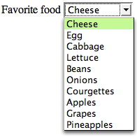

# SELECT IDAIRA

"<select>" es una etiqueta de HTML que se utiliza para crear un menú desplegable en una página web. Este elemento permite al usuario seleccionar una opción de una lista predefinida de opciones. Cuando se usa "<select>", se incluyen una o más etiquetas "<option>2 dentro de él para definir las diferentes opciones que el usuario puede elegir.